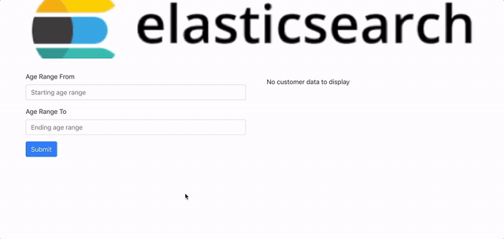

## Mini Healthcare App

## Table of contents

- [Preface](#Preface)
- [How to start](#How-to-start)
- [Technologies used for this project](#Technologies-used-for-this-project)
- [Contributors](#Contributors)

## Preface

The application demonstrates how to search data using elastic search. The elastic search functionality is implemented at the Nodejs server end.

Here's a little demo..

## How to start

1. Clone the git repository into a new directory on your computer: `git@github.com:LavanyaJay/kibanabank.git`
2. Run `npm install` on your terminal to install all the dependendencies
3. Run `npm start` to get a preview of the front-end

## Technologies used for this project

1. React with `create-react-app`
2. superagent

## Contributor

- Lavanya Jayapalan | [Github](https://github.com/LavanyaJay)
